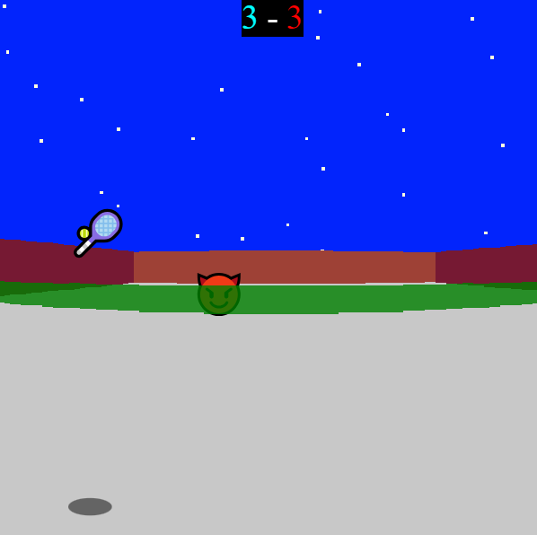

# CrazyTennis
  
This game was created over 4 days for a programming lab with [TUMO Paris](https://paris.tumo.fr/). It was my first successful [raycasting](https://en.wikipedia.org/wiki/Ray_casting) project. It's a simple tennis game in which you move with the arrow keys, and hit the ball with the space bar.  
You can enjoy it [here](https://editor.p5js.org/come.d/sketches/q0zRkDT85).  
The gameplay is a simple match in 6 points against a bot, who starts moving faster when you're gaining ground, and slower in the opposite case. The main point of this project was not developing an interesting game to play, though you can certainly squeeze a few minutes of fun out of it, but rather building a raycasting projection engine for the first time, complete with sprites and shadows, with only 4 days and a 2D drawing library.
